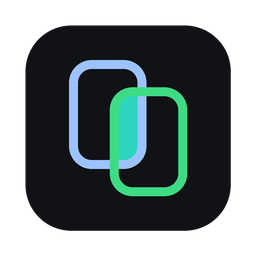

<p align="center">
  
</p>

# SimUtil desktop

Flutter desktop app (macOS, Windows, Linux): a tray menu that lists and
starts devices, and a window that streams and controls many Android
emulators/devices and iOS simulators side by side.

- Start devices headless (no emulator window / Simulator app) and stream
  them into the grid; stop them; slim iOS simulators to save memory.
- Touch, swipe and navigation buttons on every stream; Apple device frames
  for simulators (from your Xcode), drawn frames otherwise.
- Grid or spotlight layouts (one stream large, the rest in a strip).
- Record one device or the whole grid to `~/Movies/SimUtil`
  (`~/Videos/SimUtil` on Windows/Linux).
- Right-click a device for per-device settings (headless, cold boot,
  stream resolution / frame rate / bit rate).
- Clear Xcode DerivedData (macOS) from the top bar or the tray menu, after a
  confirmation.
- MCP server for agents, see below.

## MCP server

SimUtil serves [MCP](https://modelcontextprotocol.io) over HTTP at
`http://127.0.0.1:8765/mcp` (loopback only; set `SIMUTIL_MCP_PORT` to change
the port). Click the plug icon in the top-right corner for a copy-ready setup
for Claude Code, Codex, Cursor, Gemini CLI and VS Code; the tray menu copies
the URL. For example:

```bash
claude mcp add --transport http simutil http://127.0.0.1:8765/mcp
```

| Tool | What it does |
| ---- | ------------ |
| `list_devices` | Devices with state, slim mode, streaming, and `recording_seconds` while recording |
| `get_spotlight` | Stream layout, the device shown large, how long it and the grid have been recording |
| `start_device` / `shutdown_device` | Boot (headless by default) or shut down an emulator / simulator |
| `stream_device` | Show a running device in the grid |
| `tap` / `swipe` / `press_button` | Input with coordinates normalized to 0..1; back (Android), home, recents, lock |
| `run_scenario` | The same steps (`tap`, `swipe`, `press`, `wait`) on several Android and iOS devices in parallel; reports each device's outcome |
| `screenshot` | PNG of a running device |
| `record_device` / `record_grid` | Start / stop a recording; returns the file when stopping |
| `set_slim` | iOS simulator: turn background services off / on (reboots a running one) |

A scenario on every streamed device:

```json
{
  "steps": [
    { "action": "press", "button": "home" },
    { "action": "swipe", "x1": 0.8, "y1": 0.5, "x2": 0.2, "y2": 0.5 },
    { "action": "wait", "ms": 800 },
    { "action": "tap", "x": 0.5, "y": 0.4 }
  ]
}
```

Pass `devices` (ids or names) to pick devices; every step is checked before
any device moves.

## Requirements

- Android streaming: [scrcpy](https://github.com/Genymobile/scrcpy) 3+ installed
  (`brew install scrcpy`, `scoop install scrcpy`, `apt install scrcpy`) or
  `SCRCPY_SERVER_PATH` pointing at its `scrcpy-server`.
- iOS streaming: macOS with Xcode. On Xcode 27, Device Hub may take over input;
  the tile offers a repair (restarts the simulator's apps).
- Recording: `ffmpeg` (grid recording, and `.mp4` output for Android).
- Linux build: `libgtk-3-dev libx11-dev libxi-dev libavcodec-dev libswscale-dev`.

## Run

The app is a member of the repository's pub workspace, so resolve from the
repository root (needs the Flutter SDK):

```bash
flutter pub get
cd app
flutter run -d macos   # or windows / linux
```

Tests: `flutter test` here, or `dart run melos run test:flutter` from the root.
