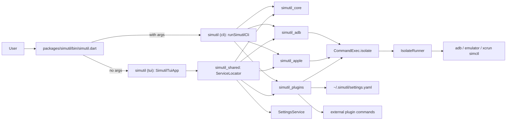

# Architecture

A short tour of `simutil`'s code, intended as progressive disclosure from
[AGENTS.md](../../AGENTS.md). Read alongside the file links — line numbers may
drift but paths are stable.

## Monorepo layout

Dart pub workspace (SDK `^3.11.0`). The root `pubspec.yaml` is `name: _`,
`publish_to: none`: it only lists workspace members and holds the
[Melos](https://melos.invertase.dev/) scripts (`melos run analyze`, `test`,
`check`, `codegen`, `compile`, `cli`). All code lives under `packages/`; each
package has its own version.

| Package | Role |
| --- | --- |
| [packages/simutil_core](../../packages/simutil_core/) | `Device`, `DeviceService`, `DeviceSession`, `CommandExec`, `IsolateRunner` (no user data); `testing.dart` fakes |
| [packages/simutil_adb](../../packages/simutil_adb/) | `AndroidDeviceService`, wireless pairing, mDNS discovery, `LogcatHelper`, `ScrcpySession` (scrcpy streaming as MPEG-TS) |
| [packages/simutil_apple](../../packages/simutil_apple/) | `IOSDeviceService` (simctl + devicectl), `XcodeCacheService`, `SimulatorSlimmer`, `SimulatorRecorder` |
| [packages/simutil_plugins](../../packages/simutil_plugins/) | `PluginCatalog` / `loadPluginCatalog`, `PluginRunner`; `testing.dart` fakes |
| [packages/simutil_shared](../../packages/simutil_shared/) | UI-agnostic app layer for TUI + GUI: `AppSettings`, `SettingsService`, `AppStateService`, `changelogEntries`, refresh intervals, `ServiceLocator` |
| [packages/simutil](../../packages/simutil/) | The app, published as `simutil`: `bin/simutil.dart`; `lib/src/cli/` (`runSimutilCli`, `SimutilCommandRunner`, `CliDeviceServices`); `lib/src/tui/` (`runSimutilTui`, `SimutilTuiApp`, components, dialogs, Linux TTY supervisor); `tool/` codegen; `packageVersion` |

`app/` (Flutter desktop GUI) depends on the libraries via pub.dev versions
overridden with `../packages/*` paths and stays **outside** the pub workspace
so root `dart pub get` never needs the Flutter SDK. Live device screens use
`DeviceSession` (`simutil_core`), implemented by `ScrcpySession`
(`simutil_adb`) and the app's iOS session over a native plugin.

Rules: `simutil_shared` must not import `nocterm` or Flutter; libraries never
import `package:simutil/` (the app).

## Subtree purpose (TUI)

- [packages/simutil/bin/simutil.dart](../../packages/simutil/bin/simutil.dart) — entry point. `runSimutilTui()`
  without arguments, otherwise `runSimutilCli(args)`.
- [packages/simutil/lib/src/tui/app/simutil_tui_app.dart](../../packages/simutil/lib/src/tui/app/simutil_tui_app.dart)
  — root `StatefulComponent`. Owns device lists, focus state, the periodic
  refresh timer, and orchestrates every dialog (launch options, ADB tools,
  logcat).
- `packages/simutil/lib/src/tui/components/` — reusable TUI widgets: panels,
  dialogs, theme (`SimutilTheme`), status bar, header.
- `packages/simutil/lib/src/tui/dialogs/` — self-contained TUI features.
  - `adb_tools/` — IP connect, pair-code wireless pairing, QR pairing dialogs.
  - `logcat/` — logcat dialog and filter bar (parsing lives in `simutil_adb`).
  - `registry/` — UI for user-defined YAML plugins (`plugin_menu_dialog.dart`,
    `command_menu_dialog.dart`, shared `menu_option_row.dart`). Internals:
    [docs/ai/plugins.md](plugins.md); user-facing guide: [docs/plugins.md](../plugins.md).
  - `xcode_tools/` — Derived Data size / clear.
- `packages/simutil/lib/src/tui/terminal/` — Linux supervisor that re-executes
  the binary as a child and restores the terminal after exit.
- Generated: `packages/simutil/lib/src/version.dart` (`tool/generate_version.dart`,
  from `packages/simutil/pubspec.yaml`) and
  `packages/simutil_shared/lib/src/changelog_entries.dart`
  (`tool/generate_changelog.dart`, from `packages/simutil/CHANGELOG.md`).

## Data flow

Key invariants:

- Services never call `Process.run` directly — they go through `CommandExec` so
  shell work happens on a background isolate and the TUI stays responsive.
- The CLI uses `CommandExec()` (sync) via `CliDeviceServices`; the TUI uses
  `CommandExec.isolate`.
- The TUI mutates state via `setState` and refreshes devices on a timer
  (`kReloadInterval`, see [packages/simutil_shared/lib/src/constants.dart](../../packages/simutil_shared/lib/src/constants.dart))
  plus a short follow-up after user actions (`kReloadAfterActionInterval`).
- iOS device discovery is no-op on non-macOS hosts; the iOS panel renders a
  "only supported on macOS" placeholder.
