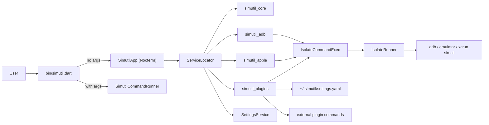

# Architecture

A short tour of `simutil`'s code, intended as progressive disclosure from
[AGENTS.md](../../AGENTS.md). Read alongside the file links — line numbers may
drift but paths are stable.

## Monorepo layout

Dart pub workspace (SDK `^3.11.0`). Root package `simutil` is the TUI + CLI app;
headless libraries live under `packages/`:

| Package | Role |
| --- | --- |
| [packages/simutil_core](../../packages/simutil_core/) | `Device`, `DeviceService`, `CommandExec`, `IsolateRunner`, `user_config` |
| [packages/simutil_adb](../../packages/simutil_adb/) | `AndroidDeviceService`, wireless pairing, mDNS discovery |
| [packages/simutil_apple](../../packages/simutil_apple/) | `IOSDeviceService` (simctl + devicectl), `XcodeCacheService` |
| [packages/simutil_plugins](../../packages/simutil_plugins/) | YAML plugin registry + command runner |
| Root [simutil](../../pubspec.yaml) | Nocterm TUI, CLI, settings/app state, built-in plugin UIs |

Import headless APIs directly (`package:simutil_adb/simutil_adb.dart`, etc.).
The app does not re-export library packages.

## Subtree purpose (app)

- [bin/simutil.dart](../../bin/simutil.dart) — entry point. Routes to the TUI
  when called without arguments, otherwise delegates to `SimutilCommandRunner`.
- [lib/simutil_app.dart](../../lib/simutil_app.dart) — root `StatefulComponent`.
  Owns device lists, focus state, the periodic refresh timer, and orchestrates
  every dialog (launch options, ADB tools, logcat).
- `lib/cli/` — `args`-based command runner and subcommands.
- `lib/components/` — reusable TUI widgets: panels, dialogs, theme
  (`SimutilTheme`), status bar, header.
- `lib/models/` — app-only data: `AppSettings` (plugin models live in
  `simutil_plugins`).
- `lib/plugins/` — self-contained TUI features.
  - `adb_tools/` — IP connect, pair-code wireless pairing, QR pairing dialogs.
  - `logcat/` — logcat dialog, filter bar, parsing helpers.
  - `registry/` — UI for user-defined YAML plugins (`plugin_menu_dialog.dart`,
    `command_menu_dialog.dart`, shared `menu_option_row.dart`). Internals:
    [docs/ai/plugins.md](plugins.md); user-facing guide: [docs/plugins.md](../plugins.md).
- `lib/services/` — app wiring: `ServiceLocator`, settings, app state. Device
  and plugin logic lives in workspace packages.
- `lib/utils/` — small extensions, constants. **`version.dart` is generated**
  by `build_runner` + `build_version` per [build.yaml](../../build.yaml).
- `test/` — unit tests using `test` + `mocktail`. Package tests live beside
  each workspace member.

## Data flow

Key invariants:

- Services never call `Process.run` directly — they go through `CommandExec` so
  shell work happens on a background isolate and the TUI stays responsive.
- The TUI mutates state via `setState` and refreshes devices on a timer
  (`kReloadInterval`, see [lib/utils/constant.dart](../../lib/utils/constant.dart))
  plus a short follow-up after user actions (`kReloadAfterActionInterval`).
- iOS device discovery is no-op on non-macOS hosts; the iOS panel renders a
  "only supported on macOS" placeholder.
