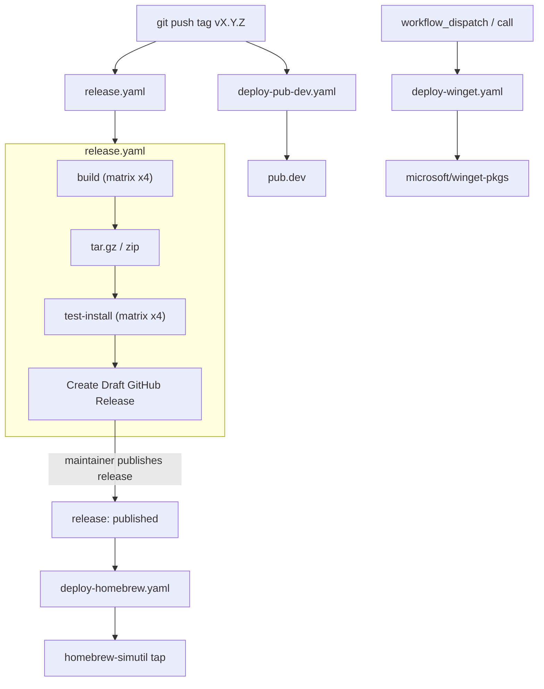

# Deployment

How `simutil` ships. This is the operational view of the workflows under
[.github/workflows/](../../.github/workflows/) — read alongside
[docs/ai/contributing.md](contributing.md), which covers what to do *before*
cutting a release.

## TL;DR

Pushing a tag that matches `v*` triggers two independent workflows in parallel:

- [release.yaml](../../.github/workflows/release.yaml) builds binaries for four
  targets, drafts a GitHub Release, and uploads archives + checksums.
- [deploy-pub-dev.yaml](../../.github/workflows/deploy-pub-dev.yaml) publishes
  the package named by the pushed tag to [pub.dev](https://pub.dev/packages/simutil):
  `vX.Y.Z` → the app, `simutil_<pkg>-vX.Y.Z` → that library.

When the GitHub Release is later **published** (i.e. promoted from draft),
[deploy-homebrew.yaml](../../.github/workflows/deploy-homebrew.yaml) fires and
updates the [`dungngminh/homebrew-simutil`](https://github.com/dungngminh/homebrew-simutil)
tap formula. The WinGet workflow is currently manual / `workflow_call` only.

## Pipeline



## Build matrix (release.yaml)

| Runner          | Target        | Artifact                          |
| --------------- | ------------- | --------------------------------- |
| `ubuntu-latest` | `linux-x64`   | `simutil-linux-x64.tar.gz`        |
| `macos-15-intel`| `macos-x64`   | `simutil-macos-x64.tar.gz`        |
| `macos-14`      | `macos-arm64` | `simutil-macos-arm64.tar.gz`      |
| `windows-latest`| `windows-x64` | `simutil-windows-x64.zip`         |

Each build runner: `dart pub get` → `dart run packages/simutil/tool/generate_changelog.dart` + `dart run packages/simutil/tool/generate_version.dart`
→ `dart compile exe packages/simutil/bin/simutil.dart -o <artifact>` → archive (`tar -czvf` on Unix,
`Compress-Archive` on Windows). The `test-install` job downloads each archive,
extracts it into a temporary install location, puts it on `PATH`, and runs
`simutil version`. The `release` job then downloads all artifacts, generates
`checksums.txt` via `sha256sum`, and creates a **draft** GitHub Release with
auto-generated notes (categorized per [.github/release.yaml](../../.github/release.yaml)).

## Workflows in detail

### release.yaml

- **Trigger**: `push` of a tag matching `v*`.
- **Output**: draft GitHub Release with four archives + `checksums.txt`.
- **Secret**: `GH_PAT` (used by `softprops/action-gh-release@v2` to create the release).
- Gates the draft release behind `test-install`, which verifies Linux, macOS
  Intel, macOS Apple Silicon, and Windows archives can be installed and run.
- The two `deploy-homebrew` / `deploy-winget` jobs at the bottom are intentionally
  commented out — Homebrew is wired to fire on `release: released` instead, and
  WinGet is manual.

### deploy-pub-dev.yaml

- **Trigger**: tag push. One tag publishes exactly one package:
  - `vX.Y.Z` → `packages/simutil` (the app). Libraries are untouched.
  - `simutil_<pkg>-vX.Y.Z` → `packages/simutil_<pkg>` only.
  - `workflow_dispatch` from a branch fails fast; run it on a tag ref.
- The job fails before publishing if the tag version differs from that
  package's `pubspec.yaml` `version:`.
- **Auth**: OIDC — uses `id-token: write` to authenticate to pub.dev. No long-lived
  token. On pub.dev, each package's **Admin → Automated publishing** must trust
  `dungngminh/simutil` with its own tag pattern: `v{{version}}` for `simutil`,
  `simutil_core-v{{version}}` for `simutil_core`, and so on.
- Runs the codegen tools so [packages/simutil/lib/src/version.dart](../../packages/simutil/lib/src/version.dart)
  matches `packages/simutil/pubspec.yaml` before publishing.

### deploy-homebrew.yaml

- **Trigger**: GitHub `release: released` (when a draft release is published) or
  `workflow_dispatch`.
- Reads `${GITHUB_REF_NAME}` (e.g. `v0.4.1`) → `VERSION=0.4.1`.
- Downloads the macOS and Linux archives from the release, computes their `sha256`,
  renders [.github/homebrew/simutil.rb.template](../../.github/homebrew/simutil.rb.template)
  with `{{VERSION}}`, `{{ARM64_SHA256}}`, `{{X64_SHA256}}`,
  `{{LINUX_X64_SHA256}}`, and pushes `Formula/simutil.rb` to the
  `dungngminh/homebrew-simutil` tap.
- **Secret**: `HOMEBREW_TAP_TOKEN` — a PAT with `contents: write` on the tap repo.

### deploy-winget.yaml

- **Trigger**: `workflow_call` or `workflow_dispatch` only (the `release: released`
  trigger is commented out).
- Uses [`vedantmgoyal9/winget-releaser@main`](https://github.com/vedantmgoyal9/winget-releaser)
  with `identifier: dungngminh.simutil` and `installers-regex:
  'simutil-windows-x64\.zip$'` to open a PR against `microsoft/winget-pkgs`.
- **Secret**: the default `GITHUB_TOKEN`.

## Cutting a release (maintainer checklist)

Versions are independent: the app (`packages/simutil`) and each library bump only
when they change. `packageVersion` shown by the app always comes from
`packages/simutil/pubspec.yaml`.

### Library release (only when a package changed)

1. In `packages/simutil_<pkg>/`, bump `version:` and add a heading to its
   `CHANGELOG.md`. If a dependent needs the new API, raise its constraint
   (e.g. `simutil_core: ^1.1.0`). `dart run melos version --no-dependent-versions`
   can do the bump + tag; `--manual-version=simutil_core:1.1.0` pins it.
2. Merge to `main`, then tag and push, **dependencies first** (core → adb /
   apple / plugins → shared → cli → tui):

   ```bash
   git tag simutil_core-v1.1.0
   git push origin simutil_core-v1.1.0
   ```

3. Wait for [deploy-pub-dev.yaml](../../.github/workflows/deploy-pub-dev.yaml)
   before tagging a package that depends on it.

### App release

1. Move the `[Unreleased]` section in [CHANGELOG.md](../../packages/simutil/CHANGELOG.md) under a
   new `[X.Y.Z] - YYYY-MM-DD` heading and re-add an empty `[Unreleased]` block.
2. Bump `version:` in [packages/simutil/pubspec.yaml](../../packages/simutil/pubspec.yaml) only, then run
   `dart run melos run codegen` so `packages/simutil/tool/generate_version.dart` writes
   [packages/simutil/lib/src/version.dart](../../packages/simutil/lib/src/version.dart).
   If the app needs unreleased library changes, do the library releases first.
3. Merge to `main`, then tag and push:

   ```bash
   git tag vX.Y.Z
   git push origin vX.Y.Z
   ```

4. Watch [release.yaml](../../.github/workflows/release.yaml) and
   [deploy-pub-dev.yaml](../../.github/workflows/deploy-pub-dev.yaml) finish
   on the [Actions tab](https://github.com/dungngminh/simutil/actions).
5. Open the draft release on GitHub, edit notes if needed, then **Publish**. That
   is what fires [deploy-homebrew.yaml](../../.github/workflows/deploy-homebrew.yaml).
6. (Optional) Trigger [deploy-winget.yaml](../../.github/workflows/deploy-winget.yaml)
   manually via the Actions tab once the release is live.

### First publish of the workspace packages

None of the libraries are on pub.dev yet. pub.dev only allows automated
publishing for packages that already exist, so publish each library once by
hand (`dart pub publish --directory packages/simutil_<pkg>`, in dependency
order), configure its tag pattern on pub.dev, then use tags from then on.

## Required repo secrets

| Secret               | Used by                | Purpose                                         |
| -------------------- | ---------------------- | ----------------------------------------------- |
| `GH_PAT`             | `release.yaml`         | Create the draft release with custom notes      |
| `HOMEBREW_TAP_TOKEN` | `deploy-homebrew.yaml` | Push to `dungngminh/homebrew-simutil`           |
| `GITHUB_TOKEN`       | `deploy-winget.yaml`   | Default token for the winget-releaser PR        |

`pub.dev` uses OIDC, no secret required — but the publisher on pub.dev must
authorize this repo + the tag-push event.

## CI (not deployment, but adjacent)

[ci.yaml](../../.github/workflows/ci.yaml) runs on `push`/`pull_request` to
`main` (paths-ignore: `**.md`, `art/**`, `install.sh`):

- `analyze` job: `dart analyze --fatal-infos`.
- `build` job: same four-target matrix as release, but only verifies the
  binary compiles (`dart compile exe`) — no archive, no upload.
